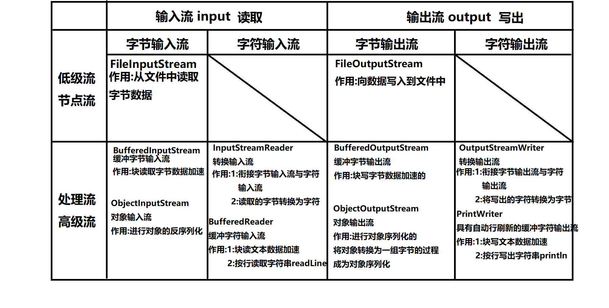

#   day04

#### 缓冲字符流

##### 缓冲字符输出流:java.io.PrintWriter

java.io.BufferedWriter和BufferedReader

缓冲字符流内部也有一个缓冲区,读写文本数据以块读写形式加快效率.并且缓冲流有一个特别的功能:可以按行读写文本数据.

java.io.PrintWriter具有自动行刷新的缓冲字符输出流,实际开发中更常用.它内部总是会自动连接BufferedWriter作为块写加速使用.


```java
package io;

import java.io.FileNotFoundException;
import java.io.PrintWriter;
import java.io.UnsupportedEncodingException;

/**
 * 缓冲字符流
 * 缓冲字符流是一对高级流,在流连接中的作用是提高读写文本数据的效率,并且
 * 可以安行读写字符串.
 * java.io.BufferedReader和BufferedWriter
 *
 * 实际开发中缓冲字符输出流我们更常用的是PrintWriter,具有自动行刷新功能
 * 的缓冲字符输出流,其内部总是连接BufferedWriter作为缓冲加速使用.
 */
public class PWDemo1 {
    public static void main(String[] args) throws FileNotFoundException {
        /*
            PrintWriter提供了对文件操作的构造方法:
            PrintWriter(String path)
            PrintWriter(File file)
         */
        //向文件中写入字符串
       	PrintWriter pw = new PrintWriter("pw.txt");
        pw.println("super idol的笑容都没你的甜。");
        pw.println("八月正午的阳光都没你耀眼。");
        System.out.println("写出完毕!");
        pw.close();

    }
}

```

##### 在流链接中使用PW

```java
package io;

import java.io.*;
import java.nio.charset.StandardCharsets;
import java.util.Scanner;

/**
 * 在流连接中使用PrintWriter
 */
public class PWDemo2 {
    public static void main(String[] args) throws FileNotFoundException {
        //如果希望有追加模式，则需要自行创建文件输出流并指定
        FileOutputStream fos = new FileOutputStream("pw.txt",true);
        //在转换流上加上字符集，可以按照指定字符集写出。
        OutputStreamWriter osw = new OutputStreamWriter(fos, StandardCharsets.UTF_8);
        BufferedWriter bw = new BufferedWriter(osw);
        /*
            当PrintWriter第一个参数为流时，我们就支持再传入一个boolean值参数，如果该值为true则
            打开了自动行刷新功能。每当我们调用println方法后就会自动flush一次
            注意:调用print方法并不会自动flush！！！！！！！
         */
        PrintWriter pw = new PrintWriter(bw,true);

//        FileOutputStream fos = new FileOutputStream("pw.txt",true);
//        BufferedOutputStream bw = new BufferedOutputStream(osw);
        /*
            不要将PW直接链接在缓冲字节输出流上，因为PW内部总是链接这BW这个缓冲字符输出流了。
            不需要在缓冲字节流上再缓冲了，会降低效率
         */
//        PrintWriter pw = new PrintWriter(bw);

        Scanner scanner = new Scanner(System.in);
        while(true) {
            String line = scanner.nextLine();
            if("exit".equalsIgnoreCase(line)){
                break;
            }
            pw.println(line);
        }
        System.out.println("写出完毕!");

        pw.close();

    }
}

```

##### PrintWriter的自动行刷新功能

如果实例化PW时第一个参数传入的是一个流，则此时可以再传入一个boolean型的参数，此值为true时就打开了自动行刷新功能。
即:
每当我们用PW的println方法写出一行字符串后会自动flush.

```java
package io;

import java.io.*;
import java.nio.charset.StandardCharsets;
import java.util.Scanner;

/**
 * 在流连接中使用PrintWriter
 */
public class PWDemo2 {
    public static void main(String[] args) throws FileNotFoundException {
        //如果希望有追加模式，则需要自行创建文件输出流并指定
        FileOutputStream fos = new FileOutputStream("pw.txt",true);
        //在转换流上加上字符集，可以按照指定字符集写出。
        OutputStreamWriter osw = new OutputStreamWriter(fos, StandardCharsets.UTF_8);
        BufferedWriter bw = new BufferedWriter(osw);
        /*
            当PrintWriter第一个参数为流时，我们就支持再传入一个boolean值参数，如果该值为true则
            打开了自动行刷新功能。每当我们调用println方法后就会自动flush一次
            注意:调用print方法并不会自动flush！！！！！！！
         */
        PrintWriter pw = new PrintWriter(bw,true);

//        FileOutputStream fos = new FileOutputStream("pw.txt",true);
//        BufferedOutputStream bw = new BufferedOutputStream(osw);
        /*
            不要将PW直接链接在缓冲字节输出流上，因为PW内部总是链接这BW这个缓冲字符输出流了。
            不需要在缓冲字节流上再缓冲了，会降低效率
         */
//        PrintWriter pw = new PrintWriter(bw);

        Scanner scanner = new Scanner(System.in);
        while(true) {
            String line = scanner.nextLine();
            if("exit".equalsIgnoreCase(line)){
                break;
            }
            pw.println(line);
        }
        System.out.println("写出完毕!");

        pw.close();

    }
}
```


#### 缓冲字符流

##### 缓冲字符输入流:java.io.BufferedReader

是一个高级的字符流，特点是块读文本数据，并且可以按行读取字符串。

```java
package io;

import java.io.*;

/**
 * 使用缓冲字符输入流java.io.BufferedReader读取文本数据
 * 缓冲字符输入流是一个高级流，有两个主要功能:
 * 1:块读文本数据加速
 * 2:可以按行读取字符串
 */
public class BRDemo {
    public static void main(String[] args) throws IOException {
        //将当前源代码输出到控制台上
        FileInputStream fis = new FileInputStream("./src/io/BRDemo.java");
        InputStreamReader isr = new InputStreamReader(fis);
        BufferedReader br  = new BufferedReader(isr);
        String line;
        /*
            BufferedReader的readLine方法是它的独有方法，作用是读取一行字符串
            该方法返回的字符串不包含最后的换行符。如果读取了一个空行(这一行只有换行符)，那么
            返回值为空字符串，即:""。如果返回值为null则表示流读取到了末尾。
         */
        while((line = br.readLine()) != null) {
            System.out.println(line);
        }
        br.close();
    }
}

```

##### IO总结




### 异常处理

#### java异常处理机制

- java中所有错误的超类为:Throwable。其下有两个子类:Error和Exception
- Error的子类描述的都是系统错误，比如虚拟机内存溢出等。
- Exception的子类描述的都是程序错误，比如空指针，下表越界等。
- 通常我们程序中处理的异常都是Exception。

#### 异常处理机制中的try-catch

```java
package exception;

/**
 * 异常处理机制中的try-catch
 * 语法:
 * try{
 *     可能出现异常的代码片段
 * }catch(XXXException e){
 *     try中出现XXXException后的处理代码
 * }
 *
 * try语句块不能独立存在，后面必须跟catch语句块或finally语句块
 */
public class TryCatchDemo {
    public static void main(String[] args) {
        System.out.println("程序开始了");
        try {
//            String line = null;
//            String line = "";
            String line = "abc";
            //当JVM执行程序出现了某个异常时就会实例化这个异常并将其抛出
            //如果该异常没有被异常处理机制控制，则JVM会将异常隐式抛出当方法外(这里是main方法外)
            System.out.println(line.length());
            System.out.println(line.charAt(0));
            System.out.println(Integer.parseInt(line));
            //若try语句块中某句话出错了，则剩下的代码都不会执行!
            System.out.println("!!!!!!!!!!!!!!!!");


//        }catch(NullPointerException e){
//            System.out.println("出现了空指针!");
//        //catch可以定义多个，当try中不同的异常有不同处理办法时可分开捕获并处理
//        }catch(StringIndexOutOfBoundsException e){
//            System.out.println("出现了下标越界!");
        //若某些异常的处理方式相同时，可以合并在一个catch来处理
        }catch(NullPointerException|StringIndexOutOfBoundsException e){
            System.out.println("出现了空指针或下标越界并处理了!");
        //可以在下面catch超类异常来捕获并处理这一类异常。
        }catch(Exception e){
            System.out.println("反正就是出了个错");
        }

        System.out.println("程序结束了");

    }
}

```

#### 异常处理机制中的finally

- finally块定义在异常处理机制中的最后一块。它可以直接跟在try之后，或者最后一个catch之后。

- finally可以保证只要程序执行到了try语句块中，无论try语句块中的代码是否出现异常，最终finally都必定执行。
- finally通常用来做释放资源这类操作。

```java
package exception;

/**
 * 异常处理机制中的finally块
 * finally块定义在异常处理机制中的最后一块。它可以直接跟在try之后，或者最后一个catch之后。
 *
 * finally可以保证只要程序执行到了try语句块中，无论try语句块中的代码是否出现异常，最终
 *  finally都必定执行。
 *
 * finally通常用来做释放资源这类操作。
 */
public class FinallyDemo {
    public static void main(String[] args) {
        System.out.println("程序开始了...");
        try{
            String line = "abc";
//            String line = null;
            System.out.println(line.length());
            return;
        }catch(Exception e){
            System.out.println("出错了!");
        }finally{
            System.out.println("finally中的代码执行了!");
        }
        System.out.println("程序结束了!");
    }
}
```

#### IO操作时的异常处理机制应用

```java
package exception;

import java.io.FileOutputStream;
import java.io.IOException;

/**
 * IO操作时的异常处理机制应用
 */
public class FinallyDemo2 {
    public static void main(String[] args) {
        FileOutputStream fos = null;
        try {
            fos = new FileOutputStream("fos.dat");
            fos.write(1);
        } catch (IOException e) {
            e.printStackTrace();//向控制台输出当前异常的错误信息
        } finally {
            try {
                if (fos!=null) {
                    fos.close();
                }
            } catch (IOException e) {
                e.printStackTrace();
            }
        }
    }
}
```

#### 自动关闭特性

JDK7之后，java提供了一个新的特性:自动关闭。旨在IO操作中可以更简洁的使用异常处理机制完成最后的close操作。

```java
语法:
try(
   	定义需要在finally中调用close()方法关闭的对象.
){
    IO操作
}catch(XXXException e){
    ...
}
```

上述语法中可在try的"()"中定义的并初始化的对象必须实现了java.io.AutoCloseable接口,否则编译不通过.

```
public class AutocloseableDemo {
    public static void main(String[] args) {
        try(
                FileOutputStream fos = new FileOutputStream("fos.dat");
        ){
            fos.write(1);
        } catch (IOException e) {
            e.printStackTrace();//向控制台输出当前异常的错误信息
        }
    }
}
```

上述代码是编译器认可的，而不是虚拟机。编译器在编译上述代码后会在编译后的class文件中改回成FinallyDemo2案例的代码样子(上次课最后的案例)。

#### throw关键字

throw用来对外主动抛出一个异常，通常下面两种情况我们主动对外抛出异常:

- 1:当程序遇到一个满足语法，但是不满足业务要求时，可以抛出一个异常告知调用者。
- 2:程序执行遇到一个异常，但是该异常不应当在当前代码片段被解决时可以抛出给调用者。

```java
package exception;

/**
 * 测试异常的抛出
 */
public class Person {
    private int age;

    public int getAge() {
        return age;
    }

    public void setAge(int age) throws Exception {
        if(age<0||age>100){
            //使用throw对外抛出一个异常
            throw new RuntimeException("年龄不合法!");
        }
        this.age = age;
    }
}
```

```java
package exception;

/**
 * throw关键字，用来对外主动抛出一个异常。
 * 通常下面两种情况我们主动对外抛出异常:
 * 1:当程序遇到一个满足语法，但是不满足业务要求时，可以抛出一个异常告知调用者。
 * 2:程序执行遇到一个异常，但是该异常不应当在当前代码片段被解决时可以抛出给调用者。
 */
public class ThrowDemo {
    public static void main(String[] args) {
        Person p = new Person();
        p.setAge(10000);//符合语法，但是不符合业务逻辑要求。
        System.out.println("此人年龄:"+p.getAge());
    }
}
```


#### throws关键字

当一个方法中使用throw抛出一个非RuntimeException的异常时，就要在该方法上使用throws声明这个异常的抛出。此时调用该方法的代码就必须处理这个异常，否则编译不通过。

```java
package exception;

/**
 * 测试异常的抛出
 */
public class Person {
    private int age;

    public int getAge() {
        return age;
    }

    /**
     * 当一个方法使用throws声明异常抛出时,调用此方法的代码片段就必须处理这个异常
     */
    public void setAge(int age) throws Exception {
        if(age<0||age>100){
            //使用throw对外抛出一个异常
//            throw new RuntimeException("年龄不合法!");
            //除了RuntimeException之外,抛出什么异常就要在方法上声明throws什么异常
            throw new Exception("年龄不合法!");
        }
        this.age = age;
    }
}
```

当我们调用一个含有throws声明异常抛出的方法时，编译器要求我们必须处理这个异常，否则编译不通过。 处理手段有两种:

- 使用try-catch捕获并处理这个异常
- 在当前方法(本案例就是main方法)上继续使用throws声明该异常的抛出给调用者解决。 具体选取那种取决于异常处理的责任问题。

```java
package exception;

/**
 * throw关键字，用于主动对外抛出一个异常
 */
public class ThrowDemo {
    public static void main(String[] args){
        System.out.println("程序开始了...");
        try {
            Person p = new Person();
            /*
                当我们调用一个含有throws声明异常抛出的方法时,编译器要求
                我们必须添加处理异常的手段,否则编译不通过.而处理手段有两种
                1:使用try-catch捕获并处理异常
                2:在当前方法上继续使用throws声明该异常的抛出
                具体用哪种取决于异常处理的责任问题
             */
            p.setAge(100000);//典型的符合语法，但是不符合业务逻辑要求
            System.out.println("此人年龄:"+p.getAge()+"岁");
        } catch (Exception e) {
            e.printStackTrace();
        }

        System.out.println("程序结束了...");
    }
}
```

####  注意，永远不应当在main方法上使用throws!!


#### 含有throws的方法被子类重写时的规则

```java
package exception;

import java.awt.*;
import java.io.FileNotFoundException;
import java.io.IOException;
import java.sql.SQLException;

/**
 * 子类重写超类含有throws声明异常抛出的方法时对throws的几种特殊的重写规则
 */
public class ThrowsDemo {
    public void dosome()throws IOException, AWTException {}
}
class SubClass extends ThrowsDemo{
//    public void dosome()throws IOException, AWTException {}

    //可以不再抛出任何异常
//    public void dosome(){}

    //可以仅抛出部分异常
//    public void dosome()throws IOException {}

    //可以抛出超类方法抛出异常的子类型异常
//    public void dosome()throws FileNotFoundException {}

    //不允许抛出额外异常(超类方法中没有的,并且没有继承关系的异常)
//    public void dosome()throws SQLException {}

    //不可以抛出超类方法抛出异常的超类型异常
//    public void dosome()throws Exception {}
}
```


## 总结

### 缓冲字符输出流

缓冲字符输出流需要记住的是PrintWriter和BufferedReader

作用:

1:块写或块读文本数据加速

2:可以按行写或读字符串


#### java.io.PrintWriter 具有自动行刷新的缓冲字符输出流

##### 常用构造器

PrintWriter(String filename) :可以直接对给定路径的文件进行写操作

PrintWriter(File file):可以直接对File表示的文件进行写操作

上述两种构造器内部会自动完成流连接操作。


PrintWriter(OutputStream out):将PW链接在给定的字节流上(构造方法内部会自行完成转换流等流连接)

PrintWriter(Writer writer):将PW链接在其它字符流上


PrintWriter(OutputStream out,boolean autoflush)

PrintWriter(Writer writer,boolean autoflush)

上述两个构造器可以在链接到流上的同时传入第二个参数，如果该值为true则开启了自动行刷新功能。


##### 常用方法

void println(String line)：按行写出一行字符串

##### 特点

自动行刷新，当打开了该功能后，每当使用println方法写出一行字符串后就会自动flush一次


#### java异常处理机制:

- 异常处理机制是用来处理那些可能存在的异常，但是无法通过修改逻辑完全规避的场景。
- 而如果通过修改逻辑可以规避的异常是bug，不应当用异常处理机制在运行期间解决！应当在编码时及时修正

try语句块用来包含可能出错的代码片段

catch用来捕获并处理对应的异常，可以定义多个，也可以合并多个异常在一个catch中。

finally是异常的最后一块，只要程序执行到try中则必走。一般用于释放资源这类操作。

throw用于主动对外抛出异常。要么是满足语法不满足业务主动抛出异常，要么就是实际发生了异常但是不应当在当前代码片段被解决是抛出。具体情况要结合实际业务分析。

throws用于在方法声明时声明该异常的抛出，使得调用者必须处理该异常。