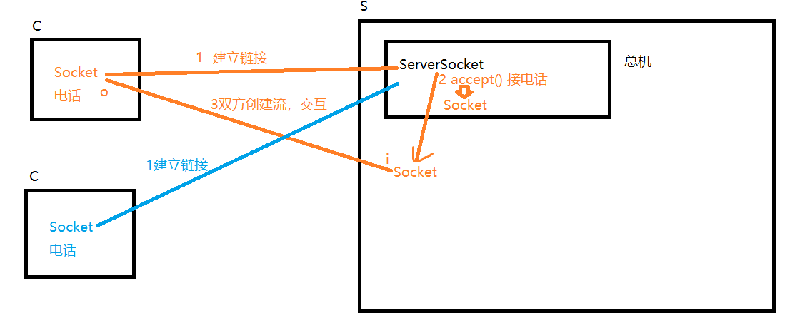
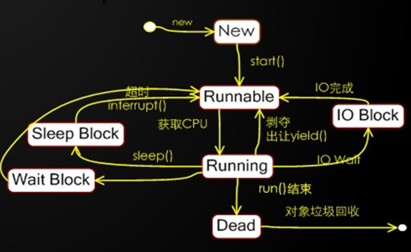
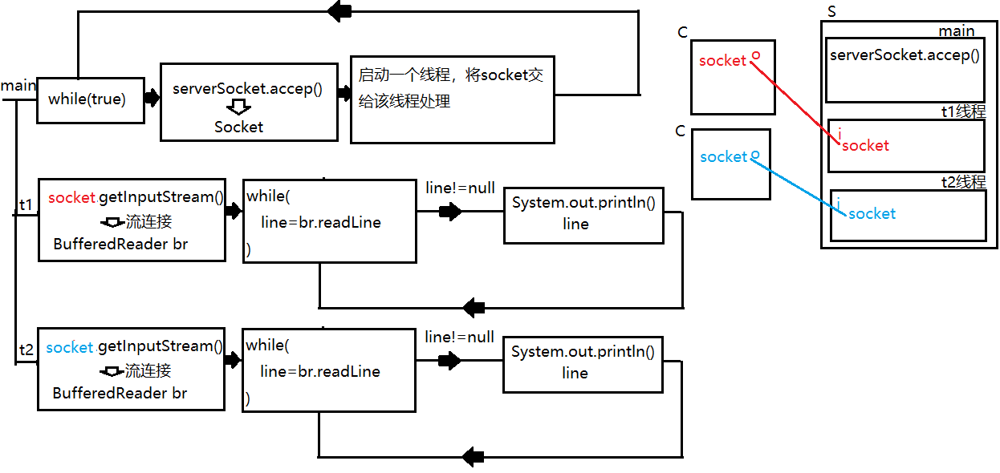

# day06
### 多客户端链接

之前只有第一个连接的客户端可以与服务端说话。

原因:

服务端只调用过一次accept方法，因此只有第一个客户端链接时服务端接受了链接并返回了Socket,此时可以与其交互。

而第二个客户端建立链接时，由于服务端没有再次调用accept，因此无法与其交互。



```java
package socket;

import java.io.BufferedReader;
import java.io.IOException;
import java.io.InputStream;
import java.io.InputStreamReader;
import java.net.ServerSocket;
import java.net.Socket;

/**
 * 聊天室服务端
 */
public class Server {
    /**
     * 运行在服务端的ServerSocket主要完成两个工作:
     * 1:向服务端操作系统申请服务端口，客户端就是通过这个端口与ServerSocket建立链接
     * 2:监听端口，一旦一个客户端建立链接，会立即返回一个Socket。通过这个Socket
     *   就可以和该客户端交互了
     *
     * 我们可以把ServerSocket想象成某客服的"总机"。用户打电话到总机，总机分配一个
     * 电话使得服务端与你沟通。
     */
    private ServerSocket serverSocket;

    /**
     * 服务端构造方法，用来初始化
     */
    public Server(){
        try {
            System.out.println("正在启动服务端...");
            /*
                实例化ServerSocket时要指定服务端口，该端口不能与操作系统其他
                应用程序占用的端口相同，否则会抛出异常:
                java.net.BindException:address already in use

                端口是一个数字，取值范围:0-65535之间。
                6000之前的的端口不要使用，密集绑定系统应用和流行应用程序。
             */
            serverSocket = new ServerSocket(8088);
            System.out.println("服务端启动完毕!");
        } catch (IOException e) {
            e.printStackTrace();
        }
    }

    /**
     * 服务端开始工作的方法
     */
    public void start(){
        try {
            while(true) {
                System.out.println("等待客户端链接...");
                /*
                    ServerSocket提供了接受客户端链接的方法:
                    Socket accept()
                    这个方法是一个阻塞方法，调用后方法"卡住"，此时开始等待客户端
                    的链接，直到一个客户端链接，此时该方法会立即返回一个Socket实例
                    通过这个Socket就可以与客户端进行交互了。

                    可以理解为此操作是接电话，电话没响时就一直等。
                 */
                Socket socket = serverSocket.accept();
                System.out.println("一个客户端链接了！");
                /*
                    Socket提供的方法:
                    InputStream getInputStream()
                    获取的字节输入流读取的是对方计算机发送过来的字节
                 */
                InputStream in = socket.getInputStream();
                InputStreamReader isr = new InputStreamReader(in, "UTF-8");
                BufferedReader br = new BufferedReader(isr);

                String message = null;
                while ((message = br.readLine()) != null) {
                    System.out.println("客户端说:" + message);
                }
            }
        } catch (IOException e) {
            e.printStackTrace();
        }
    }

    public static void main(String[] args) {
        Server server = new Server();
        server.start();
    }
}
```

添加循环操作后，发现依然无法实现。

原因在于:

外层的while循环里面嵌套了一个内层循环(循环读取客户端发送消息)，而循环执行机制决定了里层循环不结束，外层循环则无法进入第二次操作。


### 多线程

##### 线程:一个顺序的单一的程序执行流程就是一个线程。代码一句一句的有先后顺序的执行。

##### 多线程:多个单一顺序执行的流程并发运行。造成"感官上同时运行"的效果。

##### 并发:

多个线程实际运行是走走停停的。线程调度程序会将CPU运行时间划分为若干个时间片段并

尽可能均匀的分配给每个线程，拿到时间片的线程被CPU执行这段时间。当超时后线程调度

程序会再次分配一个时间片段给一个线程使得CPU执行它。如此反复。由于CPU执行时间在

纳秒级别，我们感觉不到切换线程运行的过程。所以微观上走走停停，宏观上感觉一起运行

的现象成为并发运行!

##### 用途:

- 当出现多个代码片段执行顺序有冲突时，希望它们各干各的时就应当放在不同线程上"同时"运行
- 一个线程可以运行，但是多个线程可以更快时，可以使用多线程运行


#####  线程的生命周期图



#### 创建线程有两种方式

##### 方式一:继承Thread并重写run方法

定义一个线程类，重写run方法，在其中定义线程要执行的任务(希望和其他线程并发执行的任务)。

注:启动该线程要调用该线程的start方法，而不是run方法！！！

```java
package thread;

/**
 * 多线程
 * 线程:程序中一个单一的顺序执行流程
 * 多线程:多个单一顺序执行流程"同时"执行
 *
 * 多线程改变了代码的执行方式，从原来的单一顺序执行流程变为多个执行流程"同时"执行。
 * 可以让多个代码片段的执行互不打扰。
 *
 * 线程之间是并发执行的，并非真正意义上的同时运行。
 * 常见线程有两种方式:
 * 1:继承Thread并重写run方法
 *
 */
public class ThreadDemo1 {
    public static void main(String[] args) {
        //创建两个线程
        Thread t1 = new MyThread1();
        Thread t2 = new MyThread2();
        /*
            启动线程,注意:不要调用run方法！！
            线程调用完start方法后会纳入到系统的线程调度器程序中被统一管理。
            线程调度器会分配时间片段给线程，使得CPU执行该线程这段时间，用完后
            线程调度器会再分配一个时间片段给一个线程，如此反复，使得多个线程
            都有机会执行一会，做到走走停停，并发运行。
            线程第一次被分配到时间后会执行它的run方法开始工作。
         */
        t1.start();
        t2.start();

    }
}
/**
 * 第一种创建线程的优点:
 * 结构简单，利于匿名内部类形式创建。
 *
 * 缺点:
 * 1:由于java是单继承的，这会导致继承了Thread就无法再继承其他类去复用方法
 * 2:定义线程的同时重写了run方法，这等于将线程的任务定义在了这个线程中导致
 *   线程只能干这件事。重(chong)用性很低。
 */
class MyThread1 extends Thread{
    public void run(){
        for (int i=0;i<1000;i++){
            System.out.println("hello姐~");
        }
    }
}
class MyThread2 extends Thread{
    public void run(){
        for (int i=0;i<1000;i++){
            System.out.println("来了~老弟!");
        }
    }
}
```

第一种创建线程的方式

优点:

在于结构简单，便于匿名内部类形式创建。

缺点:

- 1:直接继承线程，会导致不能在继承其他类去复用方法，这在实际开发中是非常不便的。
- 2:定义线程的同时重写了run方法，会导致线程与线程任务绑定在了一起，不利于线程的重用。

##### 方式二:实现Runnable接口单独定义线程任务

```java
package thread;

/**
 * 第二种创建线程的方式
 * 实现Runnable接口单独定义线程任务
 */
public class ThreadDemo2 {
    public static void main(String[] args) {
        //实例化任务
        Runnable r1 = new MyRunnable1();
        Runnable r2 = new MyRunnable2();
        //创建线程并指派任务
        Thread t1 = new Thread(r1);
        Thread t2 = new Thread(r2);

        t1.start();
        t2.start();
    }
}
class MyRunnable1 implements Runnable{
    public void run() {
        for (int i=0;i<1000;i++){
            System.out.println("你是谁啊?");
        }
    }
}
class MyRunnable2 implements Runnable{
    public void run() {
        for (int i=0;i<1000;i++){
            System.out.println("开门!查水表的!");
        }
    }
}
```

#### 匿名内部类形式的线程创建

```java
package thread;

/**
 * 使用匿名内部类完成线程的两种创建
 */
public class ThreadDemo3 {
    public static void main(String[] args) {
        Thread t1 = new Thread(){
            public void run(){
                for(int i=0;i<1000;i++){
                    System.out.println("你是谁啊?");
                }
            }
        };
//        Runnable r2 = new Runnable() {
//            public void run() {
//                for(int i=0;i<1000;i++){
//                    System.out.println("我是查水表的!");
//                }
//            }
//        };
        //Runnable可以使用lambda表达式创建
        Runnable r2 = ()->{
                for(int i=0;i<1000;i++){
                    System.out.println("我是查水表的!");
                }
        };


        Thread t2 = new Thread(r2);

        t1.start();
        t2.start();
    }
}

```

#### java中的代码都是靠线程运行的，执行main方法的线程称为"主线程"。

线程提供了一个方法:
* static Thread currentThread()

  该方法可以获取运行这个方法的线程

```java
package thread;

/**
 * java中所有的代码都是靠线程执行的，main方法也不例外。JVM启动后会创建一条线程来执行main
 * 方法，该线程的名字叫做"main",所以通常称它为"主线程"。
 * 我们自己定义的线程在不指定名字的情况下系统会分配一个名字，格式为"thread-x"(x是一个数)。
 *
 * Thread提供了一个静态方法:
 * static Thread currentThread()
 * 获取执行该方法的线程。
 *
 */
public class CurrentThreadDemo {
    public static void main(String[] args) {
        /*
            后期会学习到一个很重要的API:ThreadLocal,它可以使得我们在一个线程上跨越多个
            方法时共享数据使用，其内部要用到currentThread方法来辨别线程。
            如spring的事物控制就是靠ThreadLocal实现的。
         */
        Thread main = Thread.currentThread();//获取执行main方法的线程(主线程)
        System.out.println("线程:"+main);

        dosome();//主线程执行dosome方法
    }
    public static void dosome(){
        Thread t = Thread.currentThread();//获取执行dosome方法的线程
        System.out.println("执行dosome方法的线程是:"+t);
    }
}

```


### 使用多线程实现多客户端连接服务端

流程图




服务端代码改造:

```java
package socket;

import java.io.BufferedReader;
import java.io.IOException;
import java.io.InputStream;
import java.io.InputStreamReader;
import java.net.ServerSocket;
import java.net.Socket;

/**
 * 聊天室服务端
 */
public class Server {
    /**
     * 运行在服务端的ServerSocket主要完成两个工作:
     * 1:向服务端操作系统申请服务端口，客户端就是通过这个端口与ServerSocket建立链接
     * 2:监听端口，一旦一个客户端建立链接，会立即返回一个Socket。通过这个Socket
     *   就可以和该客户端交互了
     *
     * 我们可以把ServerSocket想象成某客服的"总机"。用户打电话到总机，总机分配一个
     * 电话使得服务端与你沟通。
     */
    private ServerSocket serverSocket;

    /**
     * 服务端构造方法，用来初始化
     */
    public Server(){
        try {
            System.out.println("正在启动服务端...");
            /*
                实例化ServerSocket时要指定服务端口，该端口不能与操作系统其他
                应用程序占用的端口相同，否则会抛出异常:
                java.net.BindException:address already in use

                端口是一个数字，取值范围:0-65535之间。
                6000之前的的端口不要使用，密集绑定系统应用和流行应用程序。
             */
            serverSocket = new ServerSocket(8088);
            System.out.println("服务端启动完毕!");
        } catch (IOException e) {
            e.printStackTrace();
        }
    }

    /**
     * 服务端开始工作的方法
     */
    public void start(){
        try {
            while(true) {
                System.out.println("等待客户端链接...");
                /*
                    ServerSocket提供了接受客户端链接的方法:
                    Socket accept()
                    这个方法是一个阻塞方法，调用后方法"卡住"，此时开始等待客户端
                    的链接，直到一个客户端链接，此时该方法会立即返回一个Socket实例
                    通过这个Socket就可以与客户端进行交互了。

                    可以理解为此操作是接电话，电话没响时就一直等。
                 */
                Socket socket = serverSocket.accept();
                System.out.println("一个客户端链接了！");
                //启动一个线程与该客户端交互
                ClientHandler clientHandler = new ClientHandler(socket);
                Thread t = new Thread(clientHandler);
                t.start();

            }
        } catch (IOException e) {
            e.printStackTrace();
        }
    }

    public static void main(String[] args) {
        Server server = new Server();
        server.start();
    }

    /**
     * 定义线程任务
     * 目的是让一个线程完成与特定客户端的交互工作
     */
    private class ClientHandler implements Runnable{
        private Socket socket;
        public ClientHandler(Socket socket){
            this.socket = socket;
        }
        public void run(){
            try{
                 /*
                    Socket提供的方法:
                    InputStream getInputStream()
                    获取的字节输入流读取的是对方计算机发送过来的字节
                 */
                InputStream in = socket.getInputStream();
                InputStreamReader isr = new InputStreamReader(in, "UTF-8");
                BufferedReader br = new BufferedReader(isr);

                String message = null;
                while ((message = br.readLine()) != null) {
                    System.out.println("客户端说:" + message);
                }
            }catch(IOException e){
                e.printStackTrace();
            }
        }
    }


}
```


### 线程API

#### 获取线程相关信息的方法

```java
package thread;

/**
 * 获取线程相关信息的一组方法
 */
public class ThreadInfoDemo {
    public static void main(String[] args) {
        Thread main = Thread.currentThread();//获取主线程

        String name = main.getName();//获取线程的名字
        System.out.println("名字:"+name);

        long id = main.getId();//获取该线程的唯一标识
        System.out.println("id:"+id);

        int priority = main.getPriority();//获取该线程的优先级
        System.out.println("优先级:"+priority);

        boolean isAlive = main.isAlive();//该线程是否活着
        System.out.println("是否活着:"+isAlive);

        boolean isDaemon = main.isDaemon();//是否为守护线程
        System.out.println("是否为守护线程:"+isDaemon);

        boolean isInterrupted = main.isInterrupted();//是否被中断了
        System.out.println("是否被中断了:"+isInterrupted);

    }
}
```

##### 线程优先级

线程start后会纳入到线程调度器中统一管理,线程只能被动的被分配时间片并发运行,而无法主动索取时间片.线程调度器尽可能均匀的将时间片分配给每个线程.

线程有10个优先级,使用整数1-10表示

- 1为最小优先级,10为最高优先级.5为默认值
- 调整线程的优先级可以最大程度的干涉获取时间片的几率.优先级越高的线程获取时间片的次数越多,反之则越少.

```java
package thread;

public class PriorityDemo {
    public static void main(String[] args) {
        Thread max = new Thread(){
            public void run(){
                for(int i=0;i<10000;i++){
                    System.out.println("max");
                }
            }
        };
        Thread min = new Thread(){
            public void run(){
                for(int i=0;i<10000;i++){
                    System.out.println("min");
                }
            }
        };
        Thread norm = new Thread(){
            public void run(){
                for(int i=0;i<10000;i++){
                    System.out.println("nor");
                }
            }
        };
        min.setPriority(Thread.MIN_PRIORITY);
        max.setPriority(Thread.MAX_PRIORITY);
        min.start();
        norm.start();
        max.start();
    }
}
```

#####  sleep阻塞

线程提供了一个静态方法:

- static void sleep(long ms)
- 使运行该方法的线程进入阻塞状态指定的毫秒,超时后线程会自动回到RUNNABLE状态等待再次获取时间片并发运行.

```java
package thread;

public class SleepDemo {
    public static void main(String[] args) {
        System.out.println("程序开始了!");
        try {
            Thread.sleep(5000);//主线程阻塞5秒钟
        } catch (InterruptedException e) {
            e.printStackTrace();
        }
        System.out.println("程序结束了!");
    }
}
```


## 总结

### 多线程

线程:单一的顺序执行流程就是一个线程，顺序执行:代码一句一句的先后执行。

多线程:多个线程并发执行。线程之间的代码是快速被CPU切换执行的，造成一种感官上"同时"执行的效果。

#### 线程的创建方式

1. 继承Thread，重写run方法，在run方法中定义线程要执行的任务

   优点:

   - 结构简单，便于匿名内部类创建

   缺点:

   - 继承冲突:由于java单继承，导致如果继承了线程就无法再继承其他类去复用方法

   - 耦合问题:线程与任务耦合在一起，不利于线程的重用。

2. 实现Runnable接口单独定义线程任务

   优点:

   - 犹豫是实现接口，没有继承冲突问题
   - 线程与任务没有耦合关系，便于线程的重用

   缺点:

   - 创建复杂一些(其实也不能算缺点)

#### 线程Thread类的常用方法

void run():线程本身有run方法，可以在第一种创建线程时重写该方法来定义线程任务。

void start():**启动线程**的方法。调用后线程被纳入到线程调度器中统一管理，并处于RUNNABLE状态，等待分配时间片开始并发运行。

 			注:线程第一次获取时间片开始执行时会自动执行run方法。

​                  **启动线程一定是调用start方法，而不能调用run方法!**

String getName():获取线程名字

long getId():获取线程唯一标识

int getPriority():获取线程优先级，对应的是整数1-10

boolean isAlive():线程是否还活着

boolean isDaemon():是否为守护线程

boolean isInterrupted():是否被中断了

void setPriority(int priority):设置线程优先级，参数可以传入整数1-10。1为最低优先级，5为默认优先级，10为最高优先级

​												优先级越高的线程获取时间片的次数越多。可以使用Thread的常量MIN_PRIORITY,NORM_PRIORITY,MAX_PRIORITY。他们分别表示												最低，默认，最高优先级

static void sleep(long ms):静态方法sleep可以让运行该方法的线程阻塞参数ms指定的毫秒。

static Thread currentThread():获取运行该方法的线程。

#### 