# day08

### 聊天室(续)

#### 实现服务端发送消息给客户端

在服务端通过Socket获取输出流,客户端获取输入流,实现服务端将消息发送给客户端.

这里让服务端直接将客户端发送过来的消息再回复给客户端来进行测试.

服务端代码:

```java
package socket;

import java.io.*;
import java.net.ServerSocket;
import java.net.Socket;

/**
 * 聊天室服务端
 */
public class Server {
    /**
     * 运行在服务端的ServerSocket主要完成两个工作:
     * 1:向服务端操作系统申请服务端口，客户端就是通过这个端口与ServerSocket建立链接
     * 2:监听端口，一旦一个客户端建立链接，会立即返回一个Socket。通过这个Socket
     *   就可以和该客户端交互了
     *
     * 我们可以把ServerSocket想象成某客服的"总机"。用户打电话到总机，总机分配一个
     * 电话使得服务端与你沟通。
     */
    private ServerSocket serverSocket;

    /**
     * 服务端构造方法，用来初始化
     */
    public Server(){
        try {
            System.out.println("正在启动服务端...");
            /*
                实例化ServerSocket时要指定服务端口，该端口不能与操作系统其他
                应用程序占用的端口相同，否则会抛出异常:
                java.net.BindException:address already in use

                端口是一个数字，取值范围:0-65535之间。
                6000之前的的端口不要使用，密集绑定系统应用和流行应用程序。
             */
            serverSocket = new ServerSocket(8088);
            System.out.println("服务端启动完毕!");
        } catch (IOException e) {
            e.printStackTrace();
        }
    }

    /**
     * 服务端开始工作的方法
     */
    public void start(){
        try {
            while(true) {
                System.out.println("等待客户端链接...");
                /*
                    ServerSocket提供了接受客户端链接的方法:
                    Socket accept()
                    这个方法是一个阻塞方法，调用后方法"卡住"，此时开始等待客户端
                    的链接，直到一个客户端链接，此时该方法会立即返回一个Socket实例
                    通过这个Socket就可以与客户端进行交互了。

                    可以理解为此操作是接电话，电话没响时就一直等。
                 */
                Socket socket = serverSocket.accept();
                System.out.println("一个客户端链接了！");
                //启动一个线程与该客户端交互
                ClientHandler clientHandler = new ClientHandler(socket);
                Thread t = new Thread(clientHandler);
                t.start();

            }
        } catch (IOException e) {
            e.printStackTrace();
        }
    }

    public static void main(String[] args) {
        Server server = new Server();
        server.start();
    }

    /**
     * 定义线程任务
     * 目的是让一个线程完成与特定客户端的交互工作
     */
    private class ClientHandler implements Runnable{
        private Socket socket;
        private String host;//记录客户端的IP地址信息

        public ClientHandler(Socket socket){
            this.socket = socket;
            //通过socket获取远端计算机地址信息
            host = socket.getInetAddress().getHostAddress();
        }
        public void run(){
            try{
                 /*
                    Socket提供的方法:
                    InputStream getInputStream()
                    获取的字节输入流读取的是对方计算机发送过来的字节
                 */
                InputStream in = socket.getInputStream();
                InputStreamReader isr = new InputStreamReader(in, "UTF-8");
                BufferedReader br = new BufferedReader(isr);

                OutputStream out = socket.getOutputStream();
                OutputStreamWriter osw = new OutputStreamWriter(out,"UTF-8");
                BufferedWriter bw = new BufferedWriter(osw);
                PrintWriter pw = new PrintWriter(bw,true);


                String message = null;
                while ((message = br.readLine()) != null) {
                    System.out.println(host + "说:" + message);
                    //将消息回复给客户端
                    pw.println(host + "说:" + message);
                }
            }catch(IOException e){
                e.printStackTrace();
            }
        }
    }


}
```

客户端代码:

```java
package socket;

import java.io.*;
import java.net.Socket;
import java.util.Scanner;

/**
 * 聊天室客户端
 */
public class Client {
    /*
        java.net.Socket 套接字
        Socket封装了TCP协议的通讯细节，我们通过它可以与远端计算机建立链接，
        并通过它获取两个流(一个输入，一个输出)，然后对两个流的数据读写完成
        与远端计算机的数据交互工作。
        我们可以把Socket想象成是一个电话，电话有一个听筒(输入流)，一个麦克
        风(输出流)，通过它们就可以与对方交流了。
     */
    private Socket socket;

    /**
     * 构造方法，用来初始化客户端
     */
    public Client(){
        try {
            System.out.println("正在链接服务端...");
            /*
                实例化Socket时要传入两个参数
                参数1:服务端的地址信息
                     可以是IP地址，如果链接本机可以写"localhost"
                参数2:服务端开启的服务端口
                我们通过IP找到网络上的服务端计算机，通过端口链接运行在该机器上
                的服务端应用程序。
                实例化的过程就是链接的过程，如果链接失败会抛出异常:
                java.net.ConnectException: Connection refused: connect
             */
            socket = new Socket("localhost",8088);
            System.out.println("与服务端建立链接!");
        } catch (IOException e) {
            e.printStackTrace();
        }
    }

    /**
     * 客户端开始工作的方法
     */
    public void start(){
        try {
            /*
                Socket提供了一个方法:
                OutputStream getOutputStream()
                该方法获取的字节输出流写出的字节会通过网络发送给对方计算机。
             */
            //低级流，将字节通过网络发送给对方
            OutputStream out = socket.getOutputStream();
            //高级流，负责衔接字节流与字符流，并将写出的字符按指定字符集转字节
            OutputStreamWriter osw = new OutputStreamWriter(out,"UTF-8");
            //高级流，负责块写文本数据加速
            BufferedWriter bw = new BufferedWriter(osw);
            //高级流，负责按行写出字符串，自动行刷新
            PrintWriter pw = new PrintWriter(bw,true);

            //通过socket获取输入流读取服务端发送过来的消息
            InputStream in = socket.getInputStream();
            InputStreamReader isr = new InputStreamReader(in,"UTF-8");
            BufferedReader br = new BufferedReader(isr);


            Scanner scanner = new Scanner(System.in);
            while(true) {
                String line = scanner.nextLine();
                if("exit".equalsIgnoreCase(line)){
                    break;
                }
                pw.println(line);

                line = br.readLine();
                System.out.println(line);
            }

        } catch (IOException e) {
            e.printStackTrace();
        } finally {
            try {
                /*
                    通讯完毕后调用socket的close方法。
                    该方法会给对方发送断开信号。
                 */
                socket.close();
            } catch (IOException e) {
                e.printStackTrace();
            }
        }
    }

    public static void main(String[] args) {
        Client client = new Client();
        client.start();
    }
}
```

#### 服务端转发消息给所有客户端

当一个客户端发送一个消息后,服务端收到后如何转发给所有客户端.

问题:例如红色的线程一收到客户端消息后如何获取到橙色的线程二中的输出流?得不到就无法将消息转发给橙色的客户端(进一步延伸就是无法转发给所有其他客户端)

解决:内部类可以访问外部类的成员,因此在Server类上定义一个数组allOut可以被所有内部类ClientHandler实例访问.从而将这些ClientHandler实例之间想互访的数据存放在这个数组中达到共享数据的目的.对此只需要将所有ClientHandler中的输出流都存入到数组allOut中就可以达到互访输出流转发消息的目的了.

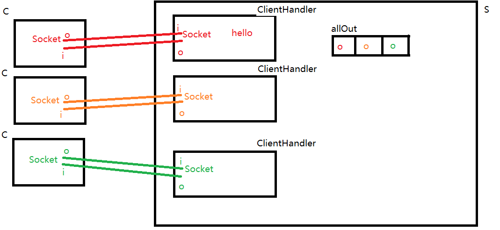

服务端代码:

```java
package socket;

import java.io.*;
import java.net.ServerSocket;
import java.net.Socket;
import java.util.Arrays;

/**
 * 聊天室服务端
 */
public class Server {
    /**
     * 运行在服务端的ServerSocket主要完成两个工作:
     * 1:向服务端操作系统申请服务端口，客户端就是通过这个端口与ServerSocket建立链接
     * 2:监听端口，一旦一个客户端建立链接，会立即返回一个Socket。通过这个Socket
     *   就可以和该客户端交互了
     *
     * 我们可以把ServerSocket想象成某客服的"总机"。用户打电话到总机，总机分配一个
     * 电话使得服务端与你沟通。
     */
    private ServerSocket serverSocket;
    /*
        存放所有客户端输出流，用于广播消息
     */
    private PrintWriter[] allOut = {};

    /**
     * 服务端构造方法，用来初始化
     */
    public Server(){
        try {
            System.out.println("正在启动服务端...");
            /*
                实例化ServerSocket时要指定服务端口，该端口不能与操作系统其他
                应用程序占用的端口相同，否则会抛出异常:
                java.net.BindException:address already in use

                端口是一个数字，取值范围:0-65535之间。
                6000之前的的端口不要使用，密集绑定系统应用和流行应用程序。
             */
            serverSocket = new ServerSocket(8088);
            System.out.println("服务端启动完毕!");
        } catch (IOException e) {
            e.printStackTrace();
        }
    }

    /**
     * 服务端开始工作的方法
     */
    public void start(){
        try {
            while(true) {
                System.out.println("等待客户端链接...");
                /*
                    ServerSocket提供了接受客户端链接的方法:
                    Socket accept()
                    这个方法是一个阻塞方法，调用后方法"卡住"，此时开始等待客户端
                    的链接，直到一个客户端链接，此时该方法会立即返回一个Socket实例
                    通过这个Socket就可以与客户端进行交互了。

                    可以理解为此操作是接电话，电话没响时就一直等。
                 */
                Socket socket = serverSocket.accept();
                System.out.println("一个客户端链接了！");
                //启动一个线程与该客户端交互
                ClientHandler clientHandler = new ClientHandler(socket);
                Thread t = new Thread(clientHandler);
                t.start();

            }
        } catch (IOException e) {
            e.printStackTrace();
        }
    }

    public static void main(String[] args) {
        Server server = new Server();
        server.start();
    }

    /**
     * 定义线程任务
     * 目的是让一个线程完成与特定客户端的交互工作
     */
    private class ClientHandler implements Runnable{
        private Socket socket;
        private String host;//记录客户端的IP地址信息

        public ClientHandler(Socket socket){
            this.socket = socket;
            //通过socket获取远端计算机地址信息
            host = socket.getInetAddress().getHostAddress();
        }
        public void run(){
            try{
                 /*
                    Socket提供的方法:
                    InputStream getInputStream()
                    获取的字节输入流读取的是对方计算机发送过来的字节
                 */
                InputStream in = socket.getInputStream();
                InputStreamReader isr = new InputStreamReader(in, "UTF-8");
                BufferedReader br = new BufferedReader(isr);

                OutputStream out = socket.getOutputStream();
                OutputStreamWriter osw = new OutputStreamWriter(out,"UTF-8");
                BufferedWriter bw = new BufferedWriter(osw);
                PrintWriter pw = new PrintWriter(bw,true);

                //将该输出流存入共享数组allOut中
                //1对allOut数组扩容
                allOut = Arrays.copyOf(allOut,allOut.length+1);
                //2将输出流存入数组最后一个位置
                allOut[allOut.length-1] = pw;


                String message = null;
                while ((message = br.readLine()) != null) {
                    System.out.println(host + "说:" + message);
                    //将消息回复给所有客户端
                    for(int i=0;i<allOut.length;i++) {
                        allOut[i].println(host + "说:" + message);
                    }
                }
            }catch(IOException e){
                e.printStackTrace();
            }
        }
    }


}
```

#### 客户端解决收发消息的冲突问题

由于客户端start方法中循环进行的操作顺序是先通过控制台输入一句话后将其发送给服务端,然后再读取服务端发送回来的一句话.这导致如果客户端不输入内容就无法收到服务端发送过来的其他信息(其他客户端的聊天内容).因此要将客户端中接收消息的工作移动到一个单独的线程上执行,才能保证收发消息互不打扰.

客户端代码:

```java
package socket;

import java.io.*;
import java.net.Socket;
import java.util.Scanner;

/**
 * 聊天室客户端
 */
public class Client {
    /*
        java.net.Socket 套接字
        Socket封装了TCP协议的通讯细节，我们通过它可以与远端计算机建立链接，
        并通过它获取两个流(一个输入，一个输出)，然后对两个流的数据读写完成
        与远端计算机的数据交互工作。
        我们可以把Socket想象成是一个电话，电话有一个听筒(输入流)，一个麦克
        风(输出流)，通过它们就可以与对方交流了。
     */
    private Socket socket;

    /**
     * 构造方法，用来初始化客户端
     */
    public Client(){
        try {
            System.out.println("正在链接服务端...");
            /*
                实例化Socket时要传入两个参数
                参数1:服务端的地址信息
                     可以是IP地址，如果链接本机可以写"localhost"
                参数2:服务端开启的服务端口
                我们通过IP找到网络上的服务端计算机，通过端口链接运行在该机器上
                的服务端应用程序。
                实例化的过程就是链接的过程，如果链接失败会抛出异常:
                java.net.ConnectException: Connection refused: connect
             */
            socket = new Socket("localhost",8088);
            System.out.println("与服务端建立链接!");
        } catch (IOException e) {
            e.printStackTrace();
        }
    }

    /**
     * 客户端开始工作的方法
     */
    public void start(){
        try {
            //启动读取服务端发送过来消息的线程
            ServerHandler handler = new ServerHandler();
            Thread t = new Thread(handler);
            t.setDaemon(true);
            t.start();


            /*
                Socket提供了一个方法:
                OutputStream getOutputStream()
                该方法获取的字节输出流写出的字节会通过网络发送给对方计算机。
             */
            //低级流，将字节通过网络发送给对方
            OutputStream out = socket.getOutputStream();
            //高级流，负责衔接字节流与字符流，并将写出的字符按指定字符集转字节
            OutputStreamWriter osw = new OutputStreamWriter(out,"UTF-8");
            //高级流，负责块写文本数据加速
            BufferedWriter bw = new BufferedWriter(osw);
            //高级流，负责按行写出字符串，自动行刷新
            PrintWriter pw = new PrintWriter(bw,true);


            Scanner scanner = new Scanner(System.in);
            while(true) {
                String line = scanner.nextLine();
                if("exit".equalsIgnoreCase(line)){
                    break;
                }
                pw.println(line);
            }

        } catch (IOException e) {
            e.printStackTrace();
        } finally {
            try {
                /*
                    通讯完毕后调用socket的close方法。
                    该方法会给对方发送断开信号。
                 */
                socket.close();
            } catch (IOException e) {
                e.printStackTrace();
            }
        }
    }

    public static void main(String[] args) {
        Client client = new Client();
        client.start();
    }

    /**
     * 该线程负责接收服务端发送过来的消息
     */
    private class ServerHandler implements Runnable{
        public void run(){
            //通过socket获取输入流读取服务端发送过来的消息
            try {
                InputStream in = socket.getInputStream();
                InputStreamReader isr = new InputStreamReader(in,"UTF-8");
                BufferedReader br = new BufferedReader(isr);

                String line;
                //循环读取服务端发送过来的每一行字符串
                while((line = br.readLine())!=null){
                    System.out.println(line);
                }
            } catch (IOException e) {
                e.printStackTrace();
            }
        }
    }
}
```

#### 服务端完成处理客户端断开连接后的操作

当一个客户端断开连接后,服务端处理该客户端交互的线程ClientHandler应当将通过socket获取的输出流从共享数组allOut中删除,防止其他的ClientHandler再将消息通过这个输出流发送给当前客户端.

服务端代码：

```java
package socket;

import java.io.*;
import java.net.ServerSocket;
import java.net.Socket;
import java.util.Arrays;

/**
 * 聊天室服务端
 */
public class Server {
    /**
     * 运行在服务端的ServerSocket主要完成两个工作:
     * 1:向服务端操作系统申请服务端口，客户端就是通过这个端口与ServerSocket建立链接
     * 2:监听端口，一旦一个客户端建立链接，会立即返回一个Socket。通过这个Socket
     *   就可以和该客户端交互了
     *
     * 我们可以把ServerSocket想象成某客服的"总机"。用户打电话到总机，总机分配一个
     * 电话使得服务端与你沟通。
     */
    private ServerSocket serverSocket;
    /*
        存放所有客户端输出流，用于广播消息
     */
    private PrintWriter[] allOut = {};

    /**
     * 服务端构造方法，用来初始化
     */
    public Server(){
        try {
            System.out.println("正在启动服务端...");
            /*
                实例化ServerSocket时要指定服务端口，该端口不能与操作系统其他
                应用程序占用的端口相同，否则会抛出异常:
                java.net.BindException:address already in use

                端口是一个数字，取值范围:0-65535之间。
                6000之前的的端口不要使用，密集绑定系统应用和流行应用程序。
             */
            serverSocket = new ServerSocket(8088);
            System.out.println("服务端启动完毕!");
        } catch (IOException e) {
            e.printStackTrace();
        }
    }

    /**
     * 服务端开始工作的方法
     */
    public void start(){
        try {
            while(true) {
                System.out.println("等待客户端链接...");
                /*
                    ServerSocket提供了接受客户端链接的方法:
                    Socket accept()
                    这个方法是一个阻塞方法，调用后方法"卡住"，此时开始等待客户端
                    的链接，直到一个客户端链接，此时该方法会立即返回一个Socket实例
                    通过这个Socket就可以与客户端进行交互了。

                    可以理解为此操作是接电话，电话没响时就一直等。
                 */
                Socket socket = serverSocket.accept();
                System.out.println("一个客户端链接了！");
                //启动一个线程与该客户端交互
                ClientHandler clientHandler = new ClientHandler(socket);
                Thread t = new Thread(clientHandler);
                t.start();

            }
        } catch (IOException e) {
            e.printStackTrace();
        }
    }

    public static void main(String[] args) {
        Server server = new Server();
        server.start();
    }

    /**
     * 定义线程任务
     * 目的是让一个线程完成与特定客户端的交互工作
     */
    private class ClientHandler implements Runnable{
        private Socket socket;
        private String host;//记录客户端的IP地址信息

        public ClientHandler(Socket socket){
            this.socket = socket;
            //通过socket获取远端计算机地址信息
            host = socket.getInetAddress().getHostAddress();
        }
        public void run(){
            PrintWriter pw = null;
            try{
                 /*
                    Socket提供的方法:
                    InputStream getInputStream()
                    获取的字节输入流读取的是对方计算机发送过来的字节
                 */
                InputStream in = socket.getInputStream();
                InputStreamReader isr = new InputStreamReader(in, "UTF-8");
                BufferedReader br = new BufferedReader(isr);

                OutputStream out = socket.getOutputStream();
                OutputStreamWriter osw = new OutputStreamWriter(out,"UTF-8");
                BufferedWriter bw = new BufferedWriter(osw);
                pw = new PrintWriter(bw,true);

                //将该输出流存入共享数组allOut中
                //1对allOut数组扩容
                allOut = Arrays.copyOf(allOut, allOut.length + 1);
                //2将输出流存入数组最后一个位置
                allOut[allOut.length - 1] = pw;
                //通知所有客户端该用户上线了
                sendMessage(host + "上线了,当前在线人数:"+allOut.length);


                String message = null;
                while ((message = br.readLine()) != null) {
                    System.out.println(host + "说:" + message);
                    //将消息回复给所有客户端
                    sendMessage(host + "说:" + message);
                }
            }catch(IOException e){
                e.printStackTrace();
            }finally{
                //处理客户端断开链接的操作
                //将当前客户端的输出流从allOut中删除(数组缩容)
                for(int i=0;i<allOut.length;i++){
                    if(allOut[i]==pw){
                        allOut[i] = allOut[allOut.length-1];
                        allOut = Arrays.copyOf(allOut,allOut.length-1);
                        break;
                    }
                }
                sendMessage(host+"下线了，当前在线人数:"+allOut.length);
                try {
                    socket.close();//与客户端断开链接
                } catch (IOException e) {
                    e.printStackTrace();
                }
            }
        }

        /**
         * 广播消息给所有客户端
         * @param message
         */
        private void sendMessage(String message){
            for(int i=0;i<allOut.length;i++) {
                allOut[i].println(message);
            }
        }
    }


}
```

#### 服务端解决多线程并发安全问题

为了让能叫消息转发给所有客户端，我们 在Server上添加了一个数组类型的属性allOut,并且共所有线程ClientHandler使用，这时对数组的操作要考虑并发安全问题

当两个客户端同时上线(橙，绿)

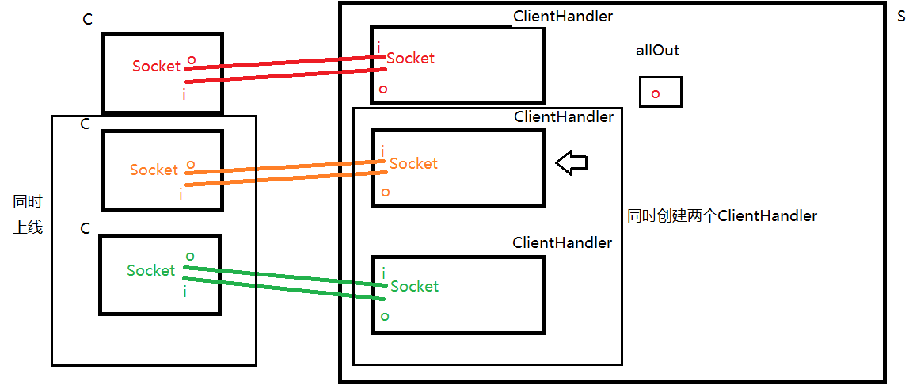

两个ClientHandler启动后都会对数组扩容，将自身的输出流存入数组

此时ClientHandler(橙)先拿到CPU时间，进行数组扩容

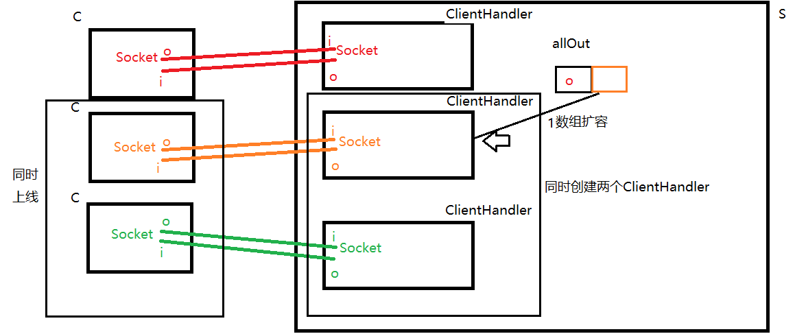

扩容后发生CPU切换，ClientHandler(绿)拿到时间

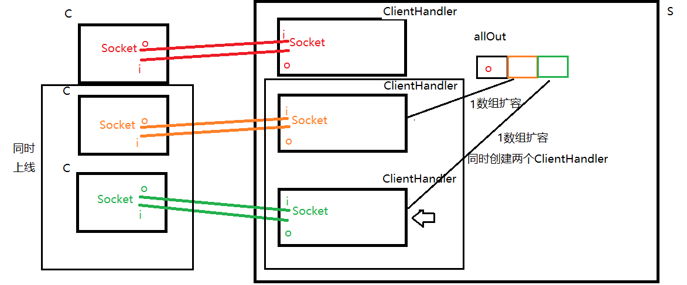

此时ClientHandler(绿)进行数组扩容


ClientHandler(绿)扩容后，将输出流存入数组最后一个位置

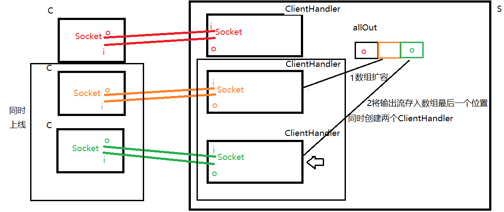

线程切换回ClientHandler(橙)

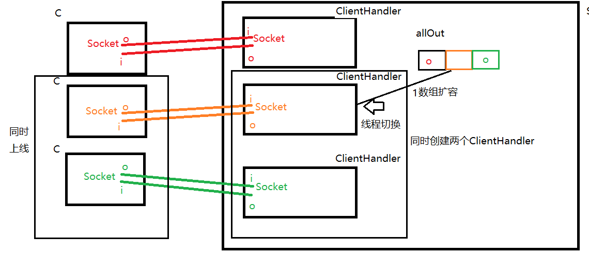

ClientHandler(橙)将输出流存入数组最后一个位置，此时会将ClientHandler(绿)存入的输入流覆盖。出现了并发安全问题!!

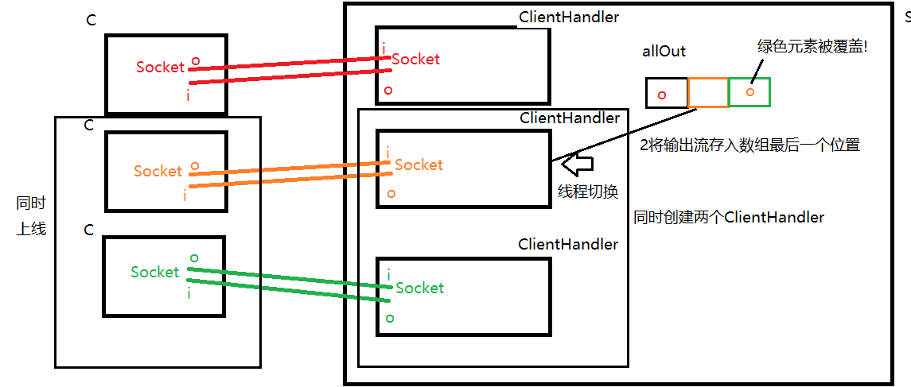

#### 选取合适的锁对象

##### this不可以

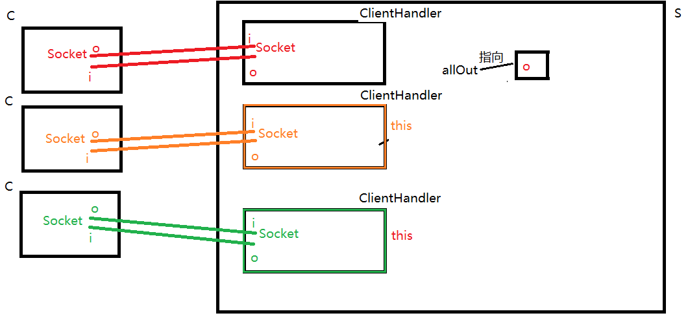


##### allOut不可以。大多数情况下可以选择临界资源作为锁对象，但是这里不行。


ClientHandler(橙)锁定allOut

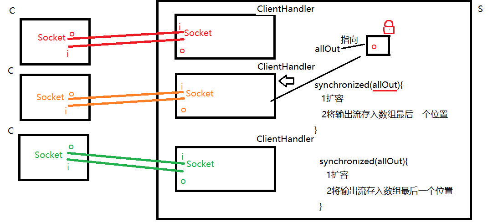

ClientHandler(橙)扩容allOut 

由于数组是定长的，扩容实际是创建新数组，因此扩容后赋值给allOut时，ClientHandler(橙)之前锁定的对象就被GC回收了！而新扩容的数组并没有锁。

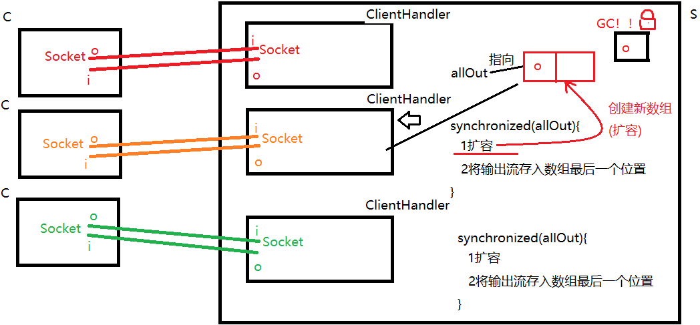

若此时发生线程切换，ClientHandler(绿)锁定allOut时，发现该allOut没有锁，因此可以锁定，并执行synchronized内部代码

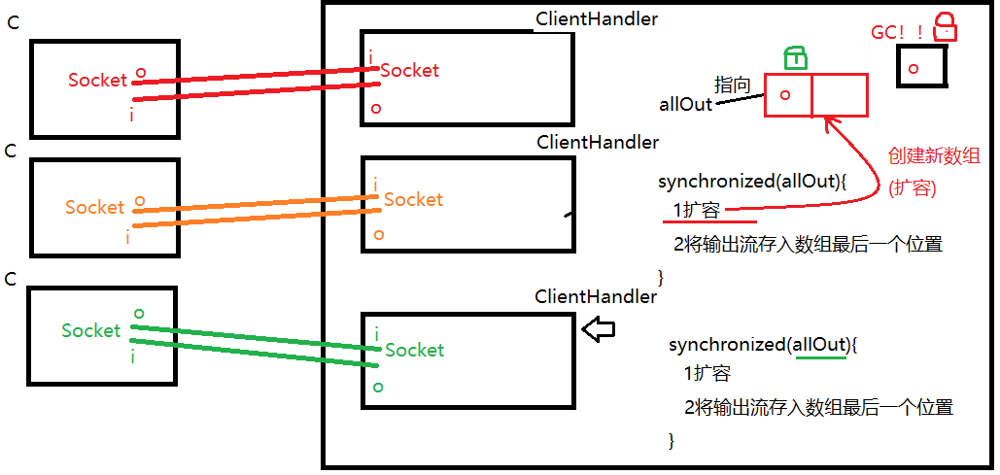

ClientHandler(绿)也可以进行数组扩容，那么它之前锁定的数组也被GC回收了!

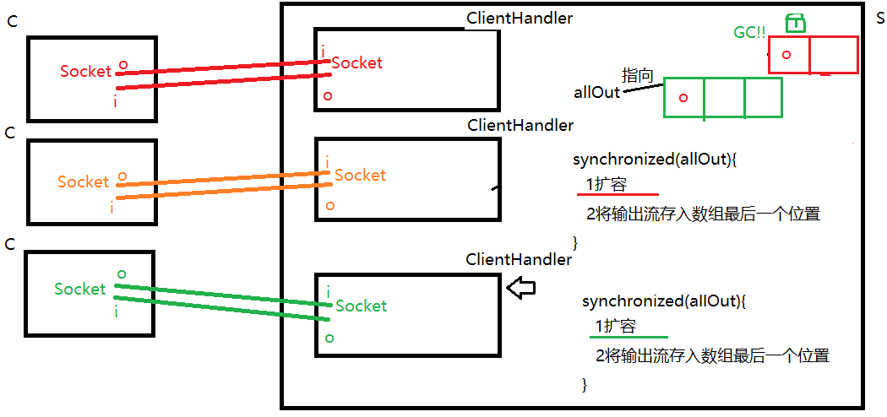

从上述代码可以看出，锁定allOut并没有限制多个线程(ClientHandler)操作allOut数组，还是存在并发安全问题。

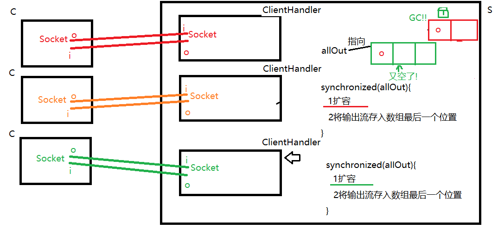


可以选取外部类对象作为锁对象，因为这些内部类ClientHandler都从属于这个外部类对象Server.this

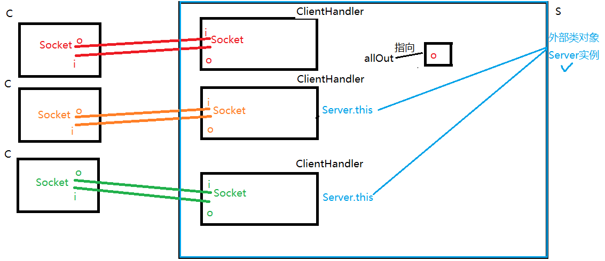

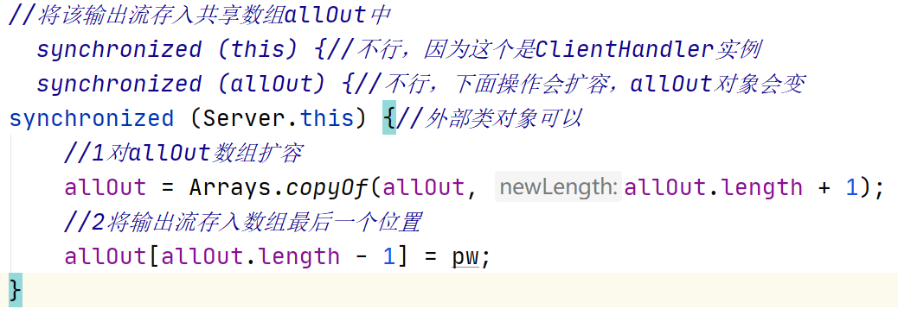

还要考虑对数组的不同操作之间的互斥问题，道理同上。因此，对allOut数组的扩容，缩容和遍历操作要进行互斥。

最终代码:

```java
package socket;

import java.io.*;
import java.net.ServerSocket;
import java.net.Socket;
import java.util.Arrays;

/**
 * 聊天室服务端
 */
public class Server {
    /**
     * 运行在服务端的ServerSocket主要完成两个工作:
     * 1:向服务端操作系统申请服务端口，客户端就是通过这个端口与ServerSocket建立链接
     * 2:监听端口，一旦一个客户端建立链接，会立即返回一个Socket。通过这个Socket
     *   就可以和该客户端交互了
     *
     * 我们可以把ServerSocket想象成某客服的"总机"。用户打电话到总机，总机分配一个
     * 电话使得服务端与你沟通。
     */
    private ServerSocket serverSocket;
    /*
        存放所有客户端输出流，用于广播消息
     */
    private PrintWriter[] allOut = {};

    /**
     * 服务端构造方法，用来初始化
     */
    public Server(){
        try {
            System.out.println("正在启动服务端...");
            /*
                实例化ServerSocket时要指定服务端口，该端口不能与操作系统其他
                应用程序占用的端口相同，否则会抛出异常:
                java.net.BindException:address already in use

                端口是一个数字，取值范围:0-65535之间。
                6000之前的的端口不要使用，密集绑定系统应用和流行应用程序。
             */
            serverSocket = new ServerSocket(8088);
            System.out.println("服务端启动完毕!");
        } catch (IOException e) {
            e.printStackTrace();
        }
    }

    /**
     * 服务端开始工作的方法
     */
    public void start(){
        try {
            while(true) {
                System.out.println("等待客户端链接...");
                /*
                    ServerSocket提供了接受客户端链接的方法:
                    Socket accept()
                    这个方法是一个阻塞方法，调用后方法"卡住"，此时开始等待客户端
                    的链接，直到一个客户端链接，此时该方法会立即返回一个Socket实例
                    通过这个Socket就可以与客户端进行交互了。

                    可以理解为此操作是接电话，电话没响时就一直等。
                 */
                Socket socket = serverSocket.accept();
                System.out.println("一个客户端链接了！");
                //启动一个线程与该客户端交互
                ClientHandler clientHandler = new ClientHandler(socket);
                Thread t = new Thread(clientHandler);
                t.start();

            }
        } catch (IOException e) {
            e.printStackTrace();
        }
    }

    public static void main(String[] args) {
        Server server = new Server();
        server.start();
    }

    /**
     * 定义线程任务
     * 目的是让一个线程完成与特定客户端的交互工作
     */
    private class ClientHandler implements Runnable{
        private Socket socket;
        private String host;//记录客户端的IP地址信息

        public ClientHandler(Socket socket){
            this.socket = socket;
            //通过socket获取远端计算机地址信息
            host = socket.getInetAddress().getHostAddress();
        }
        public void run(){
            PrintWriter pw = null;
            try{
                 /*
                    Socket提供的方法:
                    InputStream getInputStream()
                    获取的字节输入流读取的是对方计算机发送过来的字节
                 */
                InputStream in = socket.getInputStream();
                InputStreamReader isr = new InputStreamReader(in, "UTF-8");
                BufferedReader br = new BufferedReader(isr);

                OutputStream out = socket.getOutputStream();
                OutputStreamWriter osw = new OutputStreamWriter(out,"UTF-8");
                BufferedWriter bw = new BufferedWriter(osw);
                pw = new PrintWriter(bw,true);

                //将该输出流存入共享数组allOut中
//                synchronized (this) {//不行，因为这个是ClientHandler实例
//                synchronized (allOut) {//不行，下面操作会扩容，allOut对象会变
                synchronized (Server.this) {//外部类对象可以
                    //1对allOut数组扩容
                    allOut = Arrays.copyOf(allOut, allOut.length + 1);
                    //2将输出流存入数组最后一个位置
                    allOut[allOut.length - 1] = pw;
                }
                //通知所有客户端该用户上线了
                sendMessage(host + "上线了,当前在线人数:"+allOut.length);


                String message = null;
                while ((message = br.readLine()) != null) {
                    System.out.println(host + "说:" + message);
                    //将消息回复给所有客户端
                    sendMessage(host + "说:" + message);
                }
            }catch(IOException e){
                e.printStackTrace();
            }finally{
                //处理客户端断开链接的操作
                //将当前客户端的输出流从allOut中删除(数组缩容)
                synchronized (Server.this) {
                    for (int i = 0; i < allOut.length; i++) {
                        if (allOut[i] == pw) {
                            allOut[i] = allOut[allOut.length - 1];
                            allOut = Arrays.copyOf(allOut, allOut.length - 1);
                            break;
                        }
                    }
                }
                sendMessage(host+"下线了，当前在线人数:"+allOut.length);
                try {
                    socket.close();//与客户端断开链接
                } catch (IOException e) {
                    e.printStackTrace();
                }
            }
        }

        /**
         * 广播消息给所有客户端
         * @param message
         */
        private void sendMessage(String message){
            synchronized (Server.this) {
                for (int i = 0; i < allOut.length; i++) {
                    allOut[i].println(message);
                }
            }
        }
    }
}
```

##  集合框架

#### 什么是集合

集合与数组一样,可以保存一组元素,并且提供了操作元素的相关方法,使用更方便.

#### java集合框架中相关接口

#### java.util.Collection接口:

java.util.Collection是所有集合的顶级接口.Collection下面有多种实现类,因此我们有更多的数据结构可供选择.

#### Collection下面有两个常见的子接口:

- java.util.List:线性表.是可重复集合,并且有序.
- java.util.Set:不可重复的集合,大部分实现类是无序的.

这里可重复指的是集合中的元素是否可以重复,而判定重复元素的标准是依靠元素自身equals比较

的结果.为true就认为是重复元素.

```java
package collection;

import java.util.ArrayList;
import java.util.Collection;

public class CollectionDemo {
    public static void main(String[] args) {
        Collection c = new ArrayList();
        /*
            boolean add(E e)
            向当前集合中添加一个元素.当元素成功添加后返回true
         */
        c.add("one");
        c.add("two");
        c.add("three");
        c.add("four");
        c.add("five");
        System.out.println(c);
        /*
            int size()
            返回当前集合的元素个数
         */
        int size = c.size();
        System.out.println("size:"+size);
        /*
            boolean isEmpty()
            判断当前集合是否为空集(不含有任何元素)
         */
        boolean isEmpty = c.isEmpty();
        System.out.println("是否为空集:"+isEmpty);
        /*
           清空集合
         */
        c.clear();
        System.out.println(c);
        System.out.println("size:"+c.size());//0
        System.out.println("是否为空集:"+c.isEmpty());


    }
}
```


#### 集合与元素equals方法相关的方法

```java
package collection;

import java.util.ArrayList;
import java.util.Collection;
import java.util.HashSet;

/**
 * 集合的很多操作有与元素的equals方法相关。
 */
public class CollectionDemo2 {
    public static void main(String[] args) {
//        Collection c = new ArrayList();
        Collection c = new HashSet();
        c.add(new Point(1,2));
        c.add(new Point(3,4));
        c.add(new Point(5,6));
        c.add(new Point(7,8));
        c.add(new Point(1,2));
        /*
            集合重写了Object的toString方法，输出的格式为:
            [元素1.toString(), 元素2.toString(), ....]
         */
        System.out.println(c);

        Point p = new Point(1,2);
        /*
            boolean contains(Object o)
            判断当前集合是否包含给定元素，这里判断的依据是给定元素是否与集合
            现有元素存在equals比较为true的情况。
         */
        boolean contains = c.contains(p);
        System.out.println("包含:"+contains);
        /*
            remove用来从集合中删除给定元素，删除的也是与集合中equals比较
            为true的元素。注意，对于可以存放重复元素的集合而言，只删除一次。
         */
        c.remove(p);
        System.out.println(c);
    }
}
```

#### 集合存放的是元素的引用

集合只能存放引用类型元素,并且存放的是元素的引用

```java
package collection;

import java.util.ArrayList;
import java.util.Collection;

/**
 * 集合只能存放引用类型元素，并且存放的是元素的引用(地址)
 */
public class CollectionDemo3 {
    public static void main(String[] args) {
        Collection c = new ArrayList();
        Point p = new Point(1,2);
        c.add(p);
        System.out.println("p:"+p);//p:(1,2)
        System.out.println("c:"+c);//c:[(1,2)]

        p.setX(2);
        System.out.println("p:"+p);//p:(2,2)
        System.out.println("c:"+c);//c:[(2,2)]

    }
}
```


